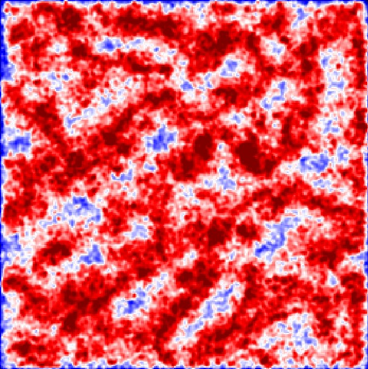

# Saliency Explanations using Complex Perturbation Approach
Generate attribution heat maps for an input image using
complex perturbation approach. 

## Description
Attribution methods find the relevance or importance(saliency) of input features in the prediction of outputs. In this project, an attibution method is developed to estimate the relevance of each pixel of an input image for its compact representaion through a complex convolutional autoencoder.
<div style="text-align:center"> </div>

## Getting Started

### File Structure
```
.
├── codes\
│   ├── build_convolutional_autoencoder.py
│   ├── obtain_attribution_contours.py
│   └── generate_heatmaps.py
├── microstructural_images\
│   ├── train\
│       └── all\
│           ├── image1.jpg
│           ├── ...
│           └── imageN.jpg
│   └── test\
│       └── all\
│           ├── image1.jpg
│           ├── ...
│           └── imageN.jpg
├── contour_inputs\
│   └── all\
│       ├── image1.jpg
│       ├── ...
│       └── imageN.jpg
├── contour_outputs\
│   └── all\
│       ├── image1.jpg
│       ├── ...
│       └── imageN.jpg
├── sinps\
│   └── all\
│       ├── image1.jpg
│       ├── ...
│       └── imageN.jpg
├── smaps\
│   ├── image1.jpg
│   ├── ...
│   └── imageN.jpg
├── license
└── README.md
```
`codes` - includes python files generation for execution.
`microstructural_images` - contains the microstructural images for the training of a convolutional autoencoder.
`contour_inputs` - holds images whose attribution contours are required.
`contour_outputs` - holds the attribution contours generated
`sinps` - holds images whose saliency heatmaps are required
`smaps` - holds the final saliency heatmaps

### Executing program

* Step 1: Use `build_convolutional_autoencoder.py` to train a convolutional autoencoder
<div style="text-align:center"></div>
* Step 2: Use `obtain_attribution_contours` to generate attributions of selected input images as grey images 
<div style="text-align:center">
 
</div>
* Step 3: Use `generate_heatmaps.py` to generate saliency heatmaps of selected attibution images
<div style="text-align:center">
 
</div>

[Compact representation and identification of important regions of metal microstructures using complex-step convolutional autoencoders](https://www.sciencedirect.com/science/article/pii/S0264127522008589e)

## License

This project is licensed under the GNU License - see the LICENSE.md file for details
